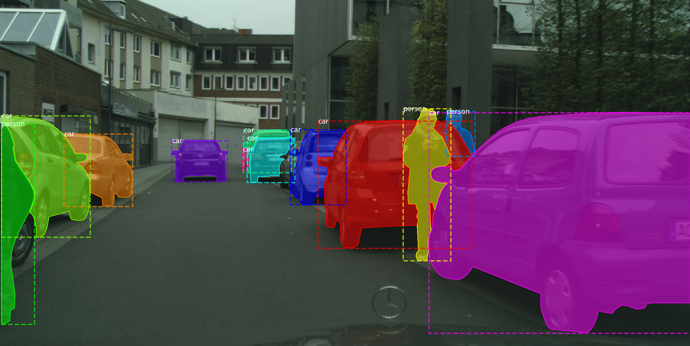
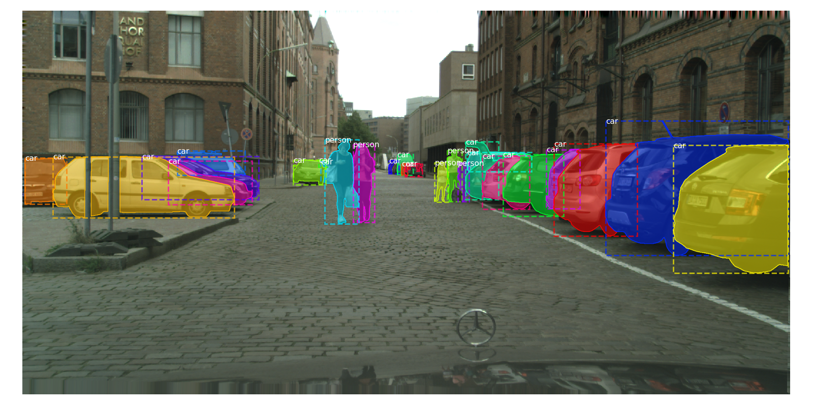
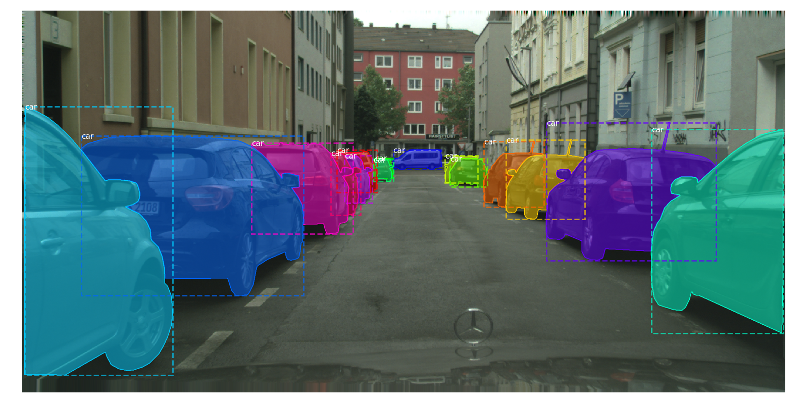

## Cityscapes to CoCo Conversion Tool


This script allows to convert the [Cityscapes Dataset](https://www.cityscapes-dataset.com/) to Mircosoft's [CoCo Format](http://cocodataset.org/). The code heavily relies on Facebook's [Detection Repo](https://github.com/facebookresearch/Detectron/blob/master/tools/convert_cityscapes_to_coco.py) and [Cityscapes Scripts](https://github.com/mcordts/cityscapesScripts). 

The converted annotations can be easily used for [Mask-RCNN](https://github.com/matterport/Mask_RCNN) or other deep learning projects.


## Folder Structure
Download the Cityscapes Dataset and organize the files in the following structure. Create an empty `annotations` directory.
```
data/
└── cityscapes
    ├── annotations
    ├── gtFine
    │   ├── test
    │   ├── train
    │   └── val
    └── leftImg8bit
        ├── test
        ├── train
        └── val
main.py
inspect_coco.py
README.md
requirements.txt
```

## Installation
```
pip install -r requirements.txt 
```


## Run
To run the conversion execute the following
```
python main.py --dataset cityscapes --datadir data/cityscapes --outdir data/cityscapes/annotations
```

In order to run the visualization of the CoCo dataset you may run
```
python inspect_coco.py --coco_dir data/cityscapes
```

## Output
 